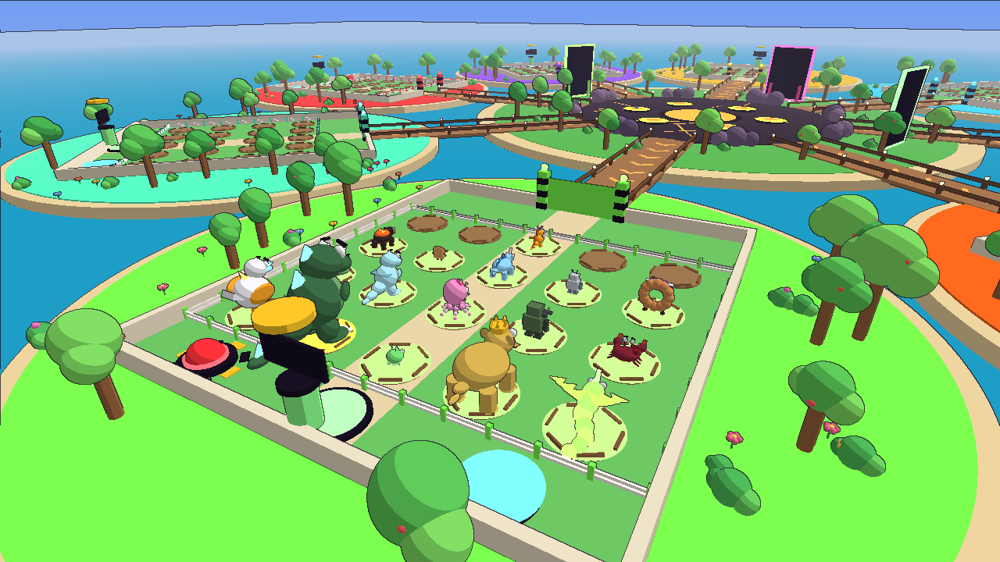

# 🦖 STEAL A KAIJU

> **Tes monstres grandissent en temps réel. Plus ils sont gros, plus ils rapportent…
> et plus tout le serveur les voit.**

Jeu Roblox complet de type « Steal a … » : des œufs de kaiju tombent en météores, tu les
fais éclore et grandir sur ton île, ils rapportent du cash. **Tes kaijus servent aussi à
jouer** : ils défendent ton île contre des vagues de monstres sauvages, tu peux devenir l'un
d'eux pour écraser une ville en jouet, et ton compagnon te suit partout pour déterrer des
trésors. Tu montes de niveau pour ouvrir **5 mondes** aux œufs de plus en plus rares. Avec
d'autres joueurs, on peut en plus se voler les kaijus (les Titans se portent à deux).

Le plan de la V2 (et pourquoi) est dans [`docs/DESIGN_V2.md`](docs/DESIGN_V2.md).

Tout le jeu est écrit en code (Luau + Rojo) : carte, modèles 3D des 46 kaijus, interface,
effets, sons originaux.



## Ce qu'il y a dans le jeu

| Système | Détail |
|---|---|
| **Niveau du joueur** | XP pour chaque action, récompense à chaque niveau, nids, mondes et menus débloqués par niveau, barre « NEXT GOAL » toujours visible |
| **5 mondes** | Kaiju Crater, Candy Coast, Frost Peaks, Volcano Core, Cosmic Rift : îles-arènes avec décor, lumière, espèces et mutation propres, portails et carte du monde |
| **Défense de l'île** | Vagues de mini-kaijus sauvages toutes les 2 min 30 : tes kaijus tirent, tu bonkes, un Alpha toutes les 5 vagues lâche un œuf |
| **RAMPAGE** | Deviens ton kaiju et écrase une ville en jouet (75 s, combos, tanks, 5 quartiers, étoiles) : cash, croissance du kaiju et œufs |
| **Compagnon** | Un de tes kaijus te suit, aspire les orbes, flaire un trésor toutes les ~50 s et t'aide au combat ; il a son propre niveau |
| **Pluie de météores** | Un œuf toutes les ~14 s dans le cratère et dans chaque monde visité, un météore perso sur ton île, et un **météore doré** (rareté supérieure, moitié prix) toutes les 5 chutes perso |
| **46 kaijus** | 7 raretés (Common → Celestial + 6 SECRETS obtenus uniquement par fusion), 9 archétypes, accessoires, animations |
| **Croissance** | 5 stades (Baby → Teen → Adult → Titan → Colossus), le modèle grandit physiquement, revenus x1 → x40, croissance même hors ligne |
| **Mutations** | Gold x2, Diamond x3, Blood Moon x4, Rainbow x5, Radioactive x6, Galaxy x8, Shadow x10 |
| **Vol** | Attraper un kaiju chez un autre, le ramener chez soi ; ralentissement selon la taille ; Titans/Colosses à deux avec partage du butin |
| **Défense** | Bouclier (dôme), protection des nouveaux joueurs, Bonker (marteau) qui fait lâcher prise, alarme |
| **Économie** | Réacteur à cash (collecte), nids à débloquer, 5 améliorations, nourriture, vente, gains hors ligne |
| **Évolution** | 25 niveaux de rebirth (multiplicateur, chance, gemmes, œuf offert) |
| **Labo de fusion** | 6 recettes secrètes + fusions aléatoires (probabilités affichées) |
| **Événements** | Meteor Shower, Blood Moon, Radioactive Storm, Golden Hour, Cosmic Aurora, Cash Stampede, **Colossal Raid** (boss à combattre ensemble) |
| **Rétention** | Série quotidienne (7 jours), 10 cadeaux de temps de jeu, 3 quêtes par jour (toutes faisables en solo), roue de la fortune, regroupés dans un seul bouton REWARDS ; codes, Kaijudex (+1 % de cash par espèce), bonus amis / groupe / Premium, classements mondiaux |
| **Boutique Premium** | 9 Game Passes + 15 produits (packs, boosts de serveur, événements achetables) |
| **Conformité 2026** | Probabilités affichées pour tout le hasard payant ; achats aléatoires masqués si `PolicyService` l'impose |
| **Anti-triche** | Serveur autoritaire, validation de chaque requête, limitation de débit, anti-téléportation pendant un vol |
| **Onboarding** | 6 missions guidées avec récompenses, menus débloqués progressivement, écran How to play en 7 pages |

Captures d'interface (rendues depuis le vrai code client) : [`docs/previews/ui/`](docs/previews/ui/).
Les 4 îles-mondes : [`docs/previews/world_candy.png`](docs/previews/world_candy.png),
[`world_frost.png`](docs/previews/world_frost.png), [`world_volcano.png`](docs/previews/world_volcano.png),
[`world_cosmic.png`](docs/previews/world_cosmic.png).

## Les 5 premières minutes (onboarding)

Le joueur est guidé par **6 missions** validées par le serveur, chacune avec une carte
d'objectif, des flèches au sol vers la cible et une récompense :

1. **Ton premier kaiju** — l'œuf de bienvenue éclôt sous tes yeux.
2. **Collecte ton cash** — marche sur le pad vert du réacteur.
3. **Attrape un œuf de météore** — flèches jusqu'au cratère, premier œuf gratuit.
4. **Défends ton île** — une petite vague d'entraînement : tes kaijus tirent, tu bonkes.
5. **RAMPAGE !** — le portail de ton île te transforme en kaiju géant dans une ville en jouet.
6. **Déterre un trésor** — ton compagnon a flairé un trésor tout près.

Ensuite, la barre **NEXT GOAL** (en haut à gauche) montre toujours le prochain objectif :
le prochain déblocage de niveau, ou le monde que tu peux ouvrir.

## La progression en solo

| Moment | Ce que le joueur poursuit |
|---|---|
| 1 min | Premier kaiju, premier niveau, nid supplémentaire |
| 5-10 min | Candy Coast (niveau 5), premier Epic, première vague de défense |
| 30 min | Frost Peaks (niveau 12), premier Titan, quartier 2 de Rampage |
| 1 h - 1 h 30 | Première Évolution (niveau 10 + cash), Volcano Core |
| 1 jour | Cosmic Rift (niveau 30 + Évolution 4), premières recettes secrètes |
| 1 semaine | Kaijudex complet (46 espèces × 8 variantes), vague 30+, 5 étoiles partout |

Mesuré par le bot d'équilibrage (joueur « parfait », environ 2 fois plus rapide qu'un
enfant) : Candy Coast à 3 min, Frost Peaks à 12 min, Évolution 1 à 45 min, Volcano Core à
58 min, Cosmic Rift à 3 h 20, Évolution 5 à 3 h 45, puis une longue fin de partie.

## Assets : icônes, modèles 3D, sons

| Dossier | Contenu | Licence |
|---|---|---|
| `assets/icons/` | 103 icônes 3D (Microsoft Fluent Emoji 3D + game-icons.net), planche `contact_sheet.png` | MIT / CC BY |
| `assets/audio/` | 42 effets + 4 musiques originaux | libre |
| `assets/models/` | modèles 3D de créatures (voir `MANIFEST.json`) | CC0 |
| `assets/vfx/` | textures de particules (Kenney) | CC0 |

**Tant qu'ils ne sont pas uploadés, le jeu reste jouable** : emojis à la place des icônes,
sons publics Roblox, modèles procéduraux, textures de particules intégrées à Roblox.

Pour tout uploader d'un coup et remplir les identifiants automatiquement :

```bash
export ROBLOX_API_KEY=...          # clé Open Cloud (permission Assets lecture/écriture)
python3 tools/upload_assets.py --user-id 123456789      # ou --group-id
```

Détails et alternative manuelle (Bulk Import dans Studio) : [`docs/UPLOAD.md`](docs/UPLOAD.md).

## Lancer le jeu dans Roblox Studio

1. Ouvre **`release/StealAKaiju.rbxlx`** dans Roblox Studio (Fichier → Ouvrir).
2. **Game Settings → Security → Enable Studio Access to API Services** : active-le pour que les
   sauvegardes fonctionnent (sinon le jeu tourne avec une sauvegarde simulée, sans erreur).
3. Appuie sur **Play**. Pour tester le vol à plusieurs : onglet **Test → Clients and Servers**,
   choisis 2 ou 3 joueurs, puis **Start**.
4. Dans Studio, les Game Passes et produits non configurés (`Id = 0`) sont **offerts
   gratuitement pour les tests**. En ligne, ils affichent « Coming soon ».

### Pour développer avec Rojo (optionnel)

```bash
rojo serve        # puis « Connect » dans le plugin Rojo de Studio
rojo build default.project.json -o release/StealAKaiju.rbxlx
```

## Avant de publier : ta checklist

1. **Game Settings → Places → Max Players = 8** (8 îles par serveur).
2. **Monétisation** : crée les Game Passes et Developer Products sur le Creator Hub, puis colle
   leurs identifiants dans `src/shared/Config/Monetization.luau` (champ `Id`). Les prix
   conseillés sont indiqués.
3. **Sons originaux** : importe les 46 fichiers de `assets/audio/` (Asset Manager → Bulk Import),
   puis colle chaque identifiant dans `src/shared/Config/Sounds.luau` (champ `Uploaded`).
   En attendant, le jeu utilise des sons publics de la bibliothèque Roblox. Voir
   `assets/audio/README.md`.
4. **Groupe Roblox** : mets l'identifiant de ton groupe dans `src/shared/Config/Rewards.luau`
   (`GroupId`) pour activer la récompense de groupe (+5 % de cash).
5. **Codes** : modifie la liste `Rewards.Codes` à chaque mise à jour.
6. **Questionnaire de maturité** : violence « cartoon » légère (bonk), pas de sang réaliste.
7. Remplis l'icône et les miniatures avec de vraies captures du jeu dans Studio.

Tous les réglages chiffrés (prix, temps, raretés, événements) sont regroupés dans
`src/shared/Config/`.

## Tests réalisés

Roblox Studio ne tourne pas sur Linux, donc j'ai construit un **simulateur Roblox headless**
(`tests/sim/`) qui exécute le **vrai code** du serveur et du client, avec une horloge
virtuelle et une validation de chaque propriété, méthode et événement contre l'API Roblox
officielle (919 classes).

```bash
./tools/test_all.sh   # environ 10 minutes
```

| Test | Résultat |
|---|---|
| Analyse de types Luau (luau-lsp) + appels entre services + méthodes de l'API Roblox | ✅ aucune nouvelle erreur |
| Tests unitaires (formules, tirages, mondes, niveaux, météore doré, 46 modèles × 8 mutations) | ✅ 15/15 |
| Playtest serveur : 3 joueurs, tutoriel complet (6 missions), météores, vol, casse à deux, bonk, bouclier, boutique, récompenses, fusion, évolution, niveaux, mondes, boss, reconnexion, 2 h de jeu | ✅ 134/134 |
| Playtest client : vrai client contre vrai serveur, 14 écrans ouverts et tous leurs boutons cliqués, cinématiques, événements | ✅ 37/37, 0 erreur |
| Compagnon : choix auto, trésors, fouille, aimant, aide au combat, pastille HUD | ✅ 94/94 |
| Défense de l'île : vague d'entraînement, tours, bonk, fuites, Alpha, pause, HUD | ✅ 98/98 |
| RAMPAGE : portail, ville, 3 types de coups vérifiés côté serveur, combo, tanks, récompenses, client | ✅ 111/111 |
| Équilibrage : un bot joue 6 h | Évolution 1 vers 45 min, Cosmic Rift vers 3 h 20, Évolution 5 vers 3 h 45 |

Ces tests ont trouvé et fait corriger de vrais bugs qui auraient cassé le jeu dans Roblox,
notamment une propriété d'éclairage non modifiable par script (le serveur aurait planté au
démarrage) et un écran de chargement qui serait resté bloqué.

**Ce que seul un test dans Studio peut confirmer** : le ressenti des contrôles et de la
caméra, la physique du recul, les performances sur mobile, l'affichage réel des polices et
emojis, et le chargement des sons.

## Organisation du code

```
src/shared/   config (kaijus, économie, événements, boutique…), logique pure, KaijuBuilder
src/server/   18 services (données, îles, kaijus, météores, mondes, niveaux, défense, Rampage, compagnon…)
src/client/   HUD, 14 fenêtres, cinématiques, rendu 3D des kaijus, météores, mondes, effets
src/first/    écran de chargement
assets/audio/ 42 effets + 4 musiques originaux (synthétisés, libres de droits)
tests/        tests unitaires + simulateur Roblox headless + playtests
tools/        vérifications, rendus d'aperçu, générateur audio
```

Le contrat client/serveur complet (actions, événements, attributs) est dans
[`docs/ARCHITECTURE.md`](docs/ARCHITECTURE.md).

## Crédits

- Sauvegarde : [ProfileStore](https://github.com/MadStudioRoblox/ProfileStore) (Apache 2.0).
- Sons et musiques : originaux, générés par `tools/audio/generate_audio.py`.
- Les polices de `tools/render/fonts/` (OFL / Apache) ne servent qu'aux rendus d'aperçu ; le
  jeu utilise les polices intégrées de Roblox.
